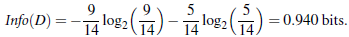
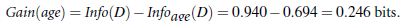
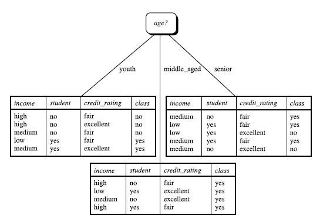

# 决策树 Decision Tree

决策树是是一个类似于流程图的树结构：其中，每个内部结点表示在一个属性上的测试，每个分支代表一个属性输出，而每个树叶结点代表类或类分布。树的最顶层是**根结点**。

下面是一个决策树的例子：

## 01 熵（entropy）

1948年，香农提出了 ”信息熵(entropy)“的概念：  一条信息的信息量大小和它的不确定性有直接的关系，要搞清楚一件非常非常不确定的事情，或者是我们一无所知的事情，需要了解大量信息==>信息量的度量就等于**不确定性的多少**

比特(bit)来衡量信息的多少

 例子：猜世界杯冠军，假如一无所知，猜多少次？

总共有32支球队，每个队夺冠的几率不是相等的，假设第i个球队冠军的概率为 $p_i$

此事件的信息熵
$$
\begin{equation}\begin{split}
H(X) &=- \sum_xP(x)log_2[P(x)] \\
     &=-(P(1)*log_2[P(1)]+P(2)*log_2[P(2)]+...+P(32)*log_2[P(32)])
\end{split}\end{equation}
$$

## 02 ID3算法

选择属性判断结点

信息获取量(Information Gain)：$Gain(A) = Infor(D) - Infor_A(D) 其中Infor(D)表示没有A时的信息量，Infor_A(D)表示有A时的信息量$ 

通过A来作为节点分类获取了多少信息.

例：

类似，Gain(income) = 0.029, Gain(student) = 0.151, Gain(credit_rating)=0.048

 所以，选择age作为第一个根节点

往下重复上诉计算可以得出完整的决策树。

## 05 应用实例

将上述ID3算法的例子用Skicit-learn和Python实现见 [Decision_tree_exercise.py](./Decision_tree_exercise.py)

【任务3 - 决策树算法梳理】时长：2天

1. 信息论基础（熵 联合熵 条件熵 信息增益 基尼不纯度） 2.决策树的不同分类算法（ID3算法、C4.5、CART分类树）的原理及应用场景
2. 回归树原理
3. 决策树防止过拟合手段
4. 模型评估
5. sklearn参数详解，Python绘制决策树

-----

**参考**

1. 周志华著《机器学习》
2. 李航著《统计学习方法》
3. 葫芦娃著《百面机器学习》
4. 

