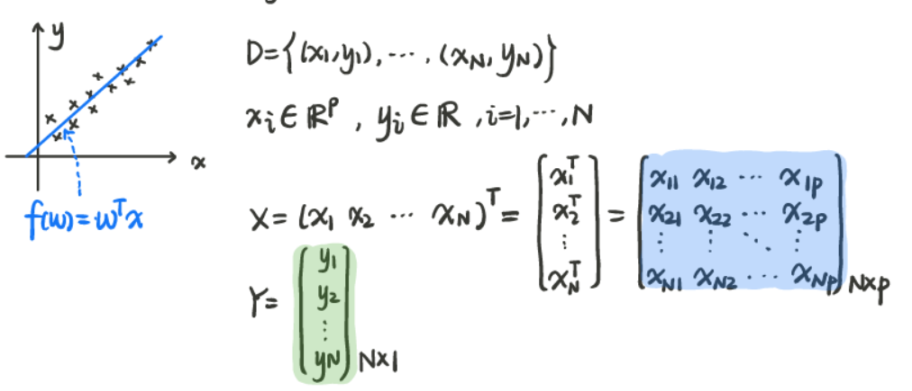
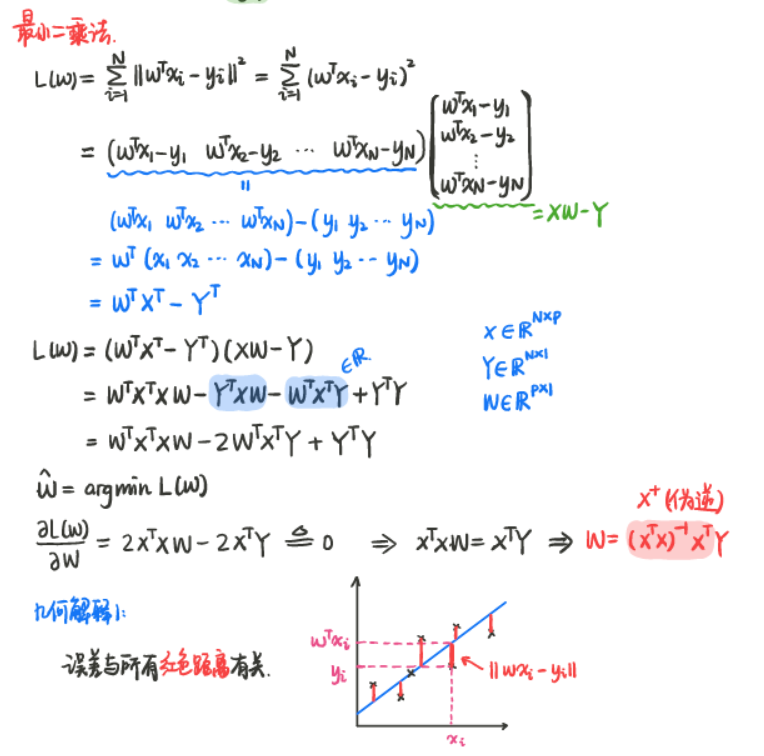
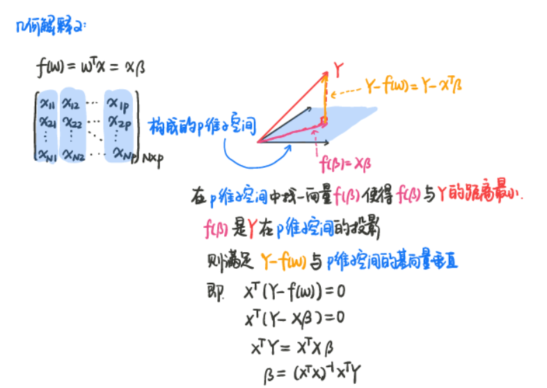
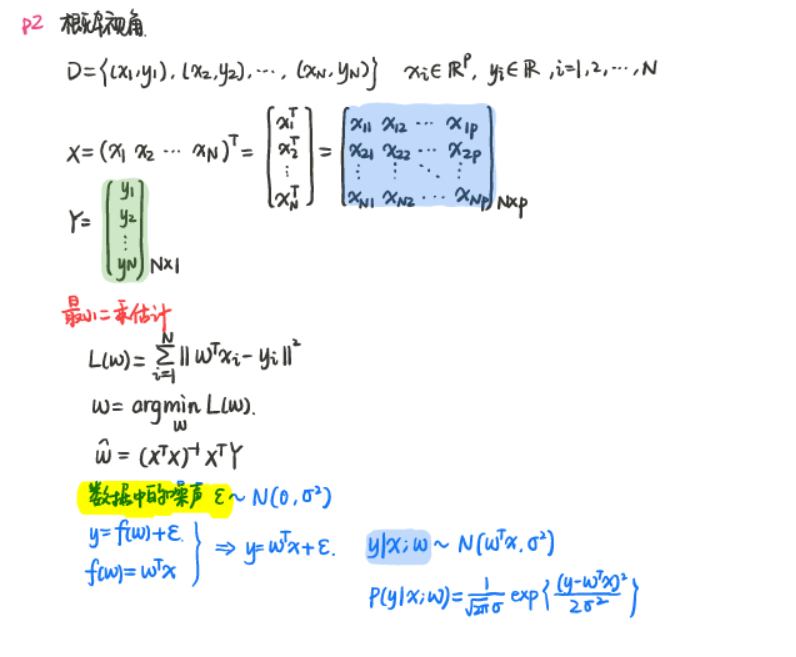
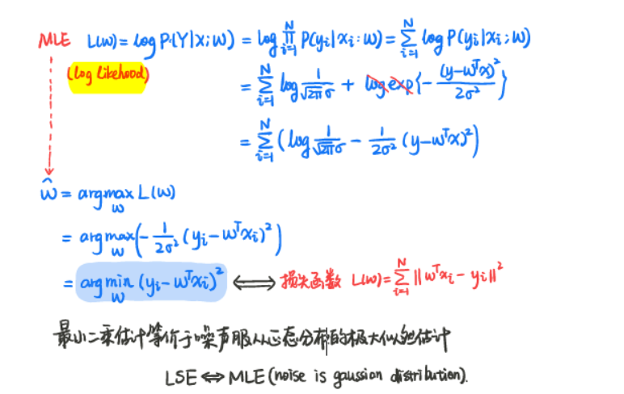
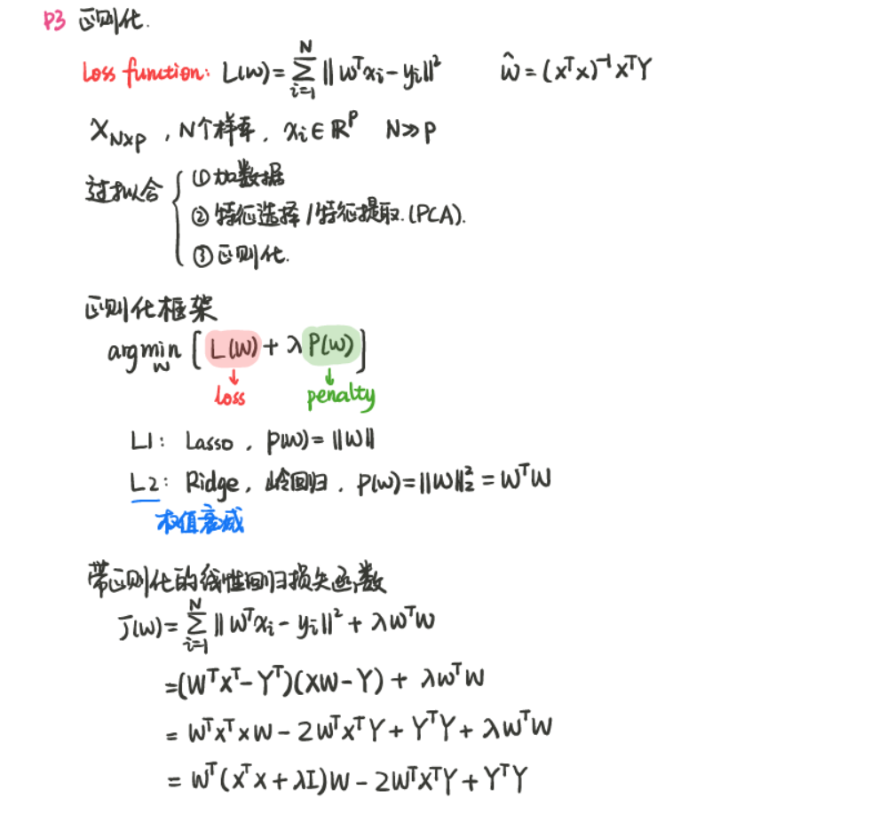
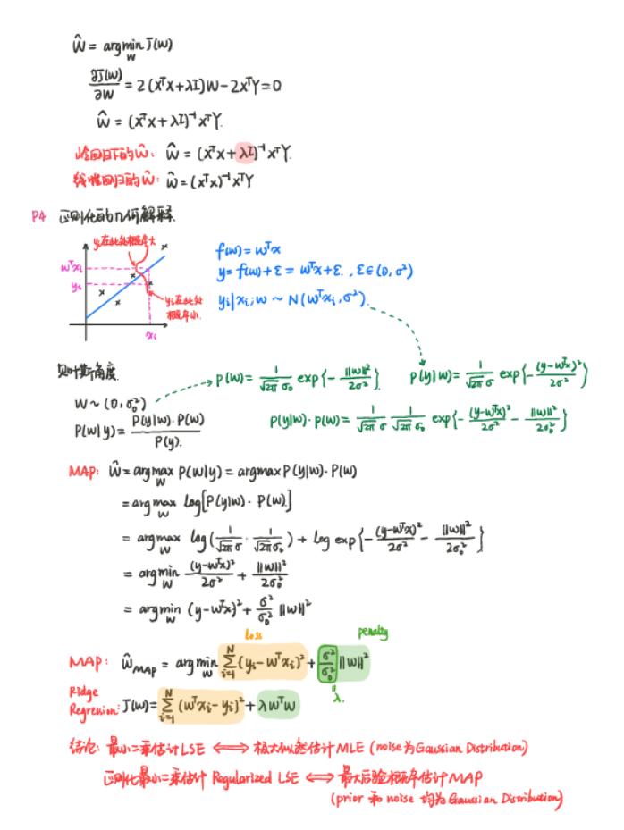
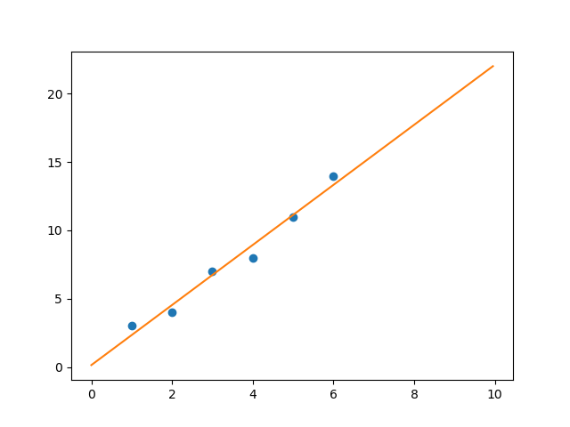
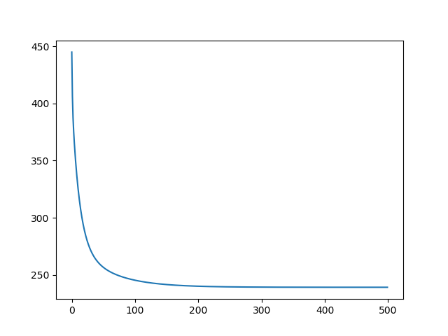

# 线性回归

最小二乘法（矩阵表达；几何意义）

概率角度：最小二乘法---noise 为Gaussion MLE

正则化： $(1) \ L_1 \to Lasso$

​			    $(2) \  L_2 \to Ridge regression 岭回归$

## 01 模型

## 02 最小二乘法（矩阵表达；几何意义）

## 03 概率角度

## 04正则化

 

## 05 Tensorflow实现

### 5.1 一元线性回归实例

已知xoy平面上的6个点(1,3),(2,4),(3,7),(4,8),(5,11),(6,14), 求一条直线 $y=wx+b$,使得这些点沿y轴方向到该直线的距离的平方和最小。

用Tensorflow实现见：[一元线性回归.py](./一元线性回归.py) 拟合的直线图像：

### 5.2 多元线性回归实例

已知xyz三维空间上的6个点(1,1,8),(2,1,12),(3,2,10),(1,2,14),(4,5,28),(5,8,10), 寻找一个超平面 $z=f(x,y)=w_1*x+w_2*y+b$ , 使得这些点到超平面(沿z轴方向)的距离和(即损失函数)最小。

用TensorFlow实现见：[多元线性回归.py](./多元线性回归.py) 迭代过程损失函数的值：

-----

**参考**

1. 周志华著《机器学习》
2. 李航著《统计学习方法》
3. 机器学习-白板推导系列： [（三）-线性回归（Linear Regression）](<https://www.bilibili.com/video/av31989606?from=search&seid=12300814341180369127>), [课程笔记](<https://github.com/ws13685555932/machine_learning_derivation>)
4. 张平著《图解神经网络与深度学习》

