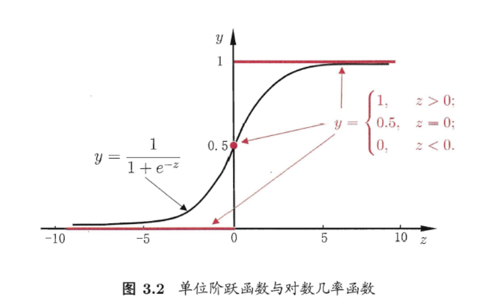

# 逻辑回归 Logistic Regression

逻辑回归 Logistic Regression，也称为“对数几率回归”。

**线性回归**：处理回归问题，因变量是连续的

**逻辑回归**：处理分类问题，因变量是离散的

以二分类为例，逻辑回归输出 $y \in  \{0,1\}$ ，而线性回归模型参生的预测值 $z =w^Tx+b$ 是实值，在自变量 $x$ 和超参数 $\theta$ 确定的情况下，逻辑回归可以看做广义线性模型在因变量 $y$ 服从二元分布时的特殊情况。

因此，我们需要将实值 $z$ 转换为 [0,1]值，最理想的是**单位阶跃函数**：
$$
y =
\begin{cases}
0,    & z<0; \\
0.5,  & z=0 \\
1,    & z>0
\end{cases}
$$
单位阶跃函数与对数几率函数：

但是**单位阶跃函数不连续**, 所以使用近似于单位阶跃函数的“对数几率函数（logistic function）”(对数几率函数是一种Sigmold函数) 代替，将 $z$ 值转化为接近0或1的 $y$ 。
$$
y = \frac 1 {1+e^{-z}}值
$$

先简单记一下逻辑回归的原理以及跟线性回归的区别，其他内容待整理。

1、逻辑回归与线性回归的联系与区别

2、 逻辑回归的原理 

3、逻辑回归损失函数推导及优化 

4、 正则化与模型评估指标 

5、逻辑回归的优缺点 

6、样本不均衡问题解决办法

-----

**参考**

1. 周志华著《机器学习》
2. 李航著《统计学习方法》
3. 葫芦娃著《百面机器学习》
4. 知乎文章：[对数几率回归 —— Logistic Regression](<https://zhuanlan.zhihu.com/p/36670444>)

